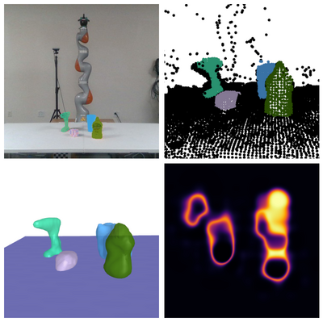
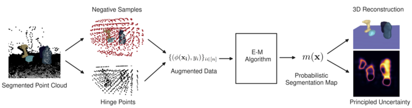

# V-PRISM: Probabilistic Mapping of Unknown Tabletop Scenes




## Overview

This is the code for the paper "V-PRISM: Probabilistic Mapping of Unknown Tabletop Scenes". Our method builds a 3D probabilistic map of a tabletop scene by using a feature transform and performing an EM algorithm. We employ a novel negative sampling technique before our feature transform to fully encode information about the scene. Our method not only reconstructs the scene accurately, but encodes valuable information about uncertainty due to occlusion. In our paper, we perform both qualitative and quantitative experiments to verify these claims. See below for a figure outlining our method.




## Usage

**Getting Started:**

1. clone the repo
    ```bash
    git clone https://github.com/Herb-Wright/v-prism.git v_prism
    cd v_prism
    ```
2. create the conda environment (if you don't have cuda, use `env_cpu.yml` instead):
    ```bash
    conda env create -f environment.yml
    ```
3. install the project
    ```bash
    pip install -e .
    ```

**Using VPRISM:**

Here is an example:

```python
from v_prism import full_VPRISM_method

map = full_VPRISM_method(X, y, num_classes, cam_pos)
```


**Running Experiments:**

1. download one the following datasets:
    - ShapeNet Scents
    - YCB Scenes
    - Objaverse Scenes  
2. run the script

If you want to evaluate PointSDF: download pt file or train


## Resources

Please consider citing our work:

```
# TODO
```


